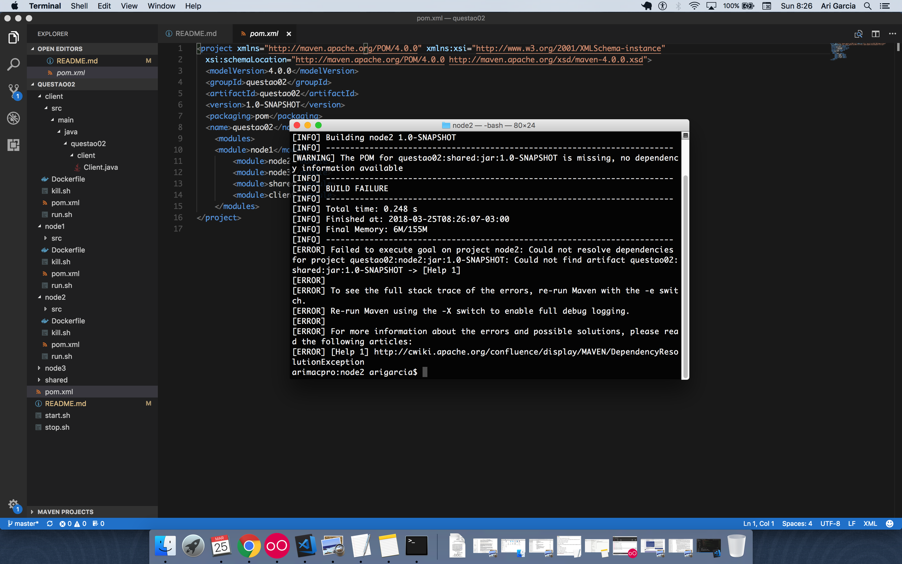

# Client

1) Você está colocando um comando para compilar e empacotar fora do docker, para quê?

```
#!/bin/bash
mvn clean package
sudo docker build -t client .
sudo docker run --net=isolated -p 2000:1099 -d --name client_app client
```

2) Você está começando pelo cliente, porque? Ele não irá demandar de início 
serviços de outras instâncias ainda não iniciadas? É possível fazer isto, mas acredito
que sua aplicação não está preparada para isto!

3) Você colocou um IP fixo nele. Como construiu a rede? Onde está a construção dessa rede?

```
Contract contract = (Contract) LocateRegistry.getRegistry("172.18.0.2", 1099).lookup("rmi://no1");
```

4) Este é um dos motivos pelo qual é solicito que todos coloquem em docker:




